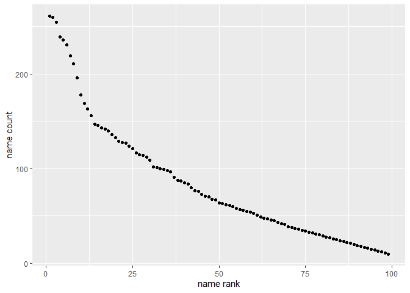

p8105_hw2_hz2771
================
Haolin Zhong (UNI: hz2771)
2021/10/1

# Import required packages

``` r
library(tidyverse)
library(readxl)
```

# Problem 1

## Read and clean the Mr.Trash Wheel sheet:

``` r
trash_wheel_path = "./data/Trash-Wheel-Collection-Totals-7-2020-2.xlsx"
trash_wheel_df = 
  read_excel(trash_wheel_path, 
             sheet = "Mr. Trash Wheel",
             range = cell_cols("A:N")) %>% 
  janitor::clean_names() %>% 
  drop_na(dumpster) %>% 
  mutate(sports_balls = round(sports_balls))
```

## Read and clean precipitation data for 2018 and 2019:

``` r
precipitation_2019 =
  read_excel(trash_wheel_path,
             sheet = "2019 Precipitation",
             skip = 1) %>%
  janitor::clean_names() %>% 
  drop_na(total, month) %>% 
  mutate(year = 2019)

precipitation_2018 = 
  read_excel(trash_wheel_path,
             sheet = "2018 Precipitation",
             skip = 1) %>% 
  janitor::clean_names() %>% 
  drop_na(total, month) %>% 
  mutate(year = 2018)
```

## Combine precipitation datasets and convert month to a character variable:

``` r
precipitation_df = 
  bind_rows(precipitation_2018, precipitation_2019) %>% 
  mutate(month = month.name[month])
```

## Describe the dataset

The Mr.Trash Wheel dataset was generated by the water-wheel trash
collector from the Inner Harbor in Baltimore, Maryland. This dataset
contains weights, volumes, and specific types of collected trash at a
month-level granularity. Besides, year-level precipitation data is also
contained.

-   After data cleaning, Mr.Trash Wheel dataset contains 454
    observations, and precipitation data for 2018 and 2019 contains 24
    observations.

-   The total precipitation in 2018 is 70.33.

-   The median number of sports balls in a dumpster in 2017 is 8.

# Problem 2

## Clean data in the `pol-month.csv`

``` r
pols_path = "./data/fivethirtyeight_datasets/pols-month.csv"
pols_df = 
  read_csv(pols_path) %>% 
  janitor::clean_names() %>% 
  separate(mon, into = c("year", "month", "day"), convert = TRUE) %>% 
  mutate(month = month.name[month],
         president = recode(prez_gop, `0` = "dem", `1` = "gop", `2` = "gop")) %>%
  select(-day, -starts_with("prez"))
```

## Clean data in the `snp.csv`

``` r
snp_path = "./data/fivethirtyeight_datasets/snp.csv"


my_parse_date = function(date){
  # the parse_date() function in readr transform year 00-69 to 2000-2069
  # yet in this dataset, year 50-99 actually means 1950-1999
  # so I define my own parse date function for correct transformation
  date = parse_date(date, format = '%m/%d/%y')
  date[format(date, "%y") >= 50] = parse_date(format(date[format(date, "%y") >= 50], "19%y-%m-%d"))
  return(date)
}

snp_df =
  read_csv(snp_path) %>% 
  janitor::clean_names() %>% 
  mutate(date = my_parse_date(date)) %>% 
  separate(date, into = c("year", "month", "day"), convert = TRUE) %>% 
  arrange(year, month) %>% 
  mutate(month = month.name[month]) %>% 
  relocate(year, month) %>% 
  select(-day)
```

## Tidy up the unemployment data

``` r
unepl_path = "./data/fivethirtyeight_datasets/unemployment.csv"

# Create a month dict to facilitate the transformation of month format
month_dict = month.name
names(month_dict) = month.abb

unepl_df = 
  read_csv(unepl_path) %>%
  pivot_longer(cols = "Jan":"Dec", names_to = "month", values_to = "unemployment_rate") %>% 
  mutate(month = as.character(month_dict[month])) %>% 
  janitor::clean_names()
```

## Integrate the three datasets

``` r
df_538 = 
  left_join(pols_df, snp_df) %>% 
  left_join(unepl_df)
```

Here we extracted 3 datasets from the FiveThirtyEight data:

-   The `pols_df` dataset
    -   It contains 9 variables and 822 observations.
    -   It shows the numbers of Republican and Democrats in governors
        and senators, as well as the party the president affiliated by
        these variables: gov_gop, sen_gop, rep_gop, gov_dem, sen_dem,
        rep_dem, president, from 1947 to 2015.
-   The `snp_df` dataset
    -   It contains 3 variables and 787 observations.
    -   Its shows the closing values of the S&P stock index on the
        associated date(unshown) by the variable close, from 1950
        to 2015.
-   The `unepl_df` dataset
    -   It contains 3 variables and 816 observations.
    -   It tells us the unemployment rate per month in US by the
        variable unemployment_rate from 1948 to 2015.

We merged the 3 datasets, and the resulting dataset has 11 variables and
822 observations. Some `NA` values may exists in the `close` and
`employment_rate` variables, due to the lack for stock data in
corresponding years or months.

# Problem 3

## Load and tidy data

The data cleaning process has considered following issues: - The case
structure of `child's first name` changed from all caps to only
capitalizing the first letter. - `ethnicity` code changed from
abbreviated description to full description. - In some years there are
duplicated names.

``` r
pop_bb_names_path = "./data/Popular_Baby_Names.csv"

pop_bb_names = 
  read_csv(pop_bb_names_path) %>% 
  janitor::clean_names() %>% 
  mutate(
    childs_first_name = str_to_title(childs_first_name),
    ethnicity = str_to_title(ethnicity)
  ) %>% 
  mutate(
    ethnicity = recode(ethnicity,
      "Asian And Paci" = "Asian And Pacific Islander",
      "Black Non Hisp" = "Black Non Hispanic",
      "White Non Hisp" = "White Non Hispanic"
    )
  ) %>% 
  distinct() %>% 
  arrange(year_of_birth,ethnicity, rank)
```

## Trend of popularity of Olivia

``` r
pop_bb_names %>% 
  filter(childs_first_name == "Olivia", 
         gender == "FEMALE") %>% 
  select(year_of_birth, ethnicity, rank) %>% 
  pivot_wider(
    names_from = year_of_birth, 
    values_from = rank)
## # A tibble: 4 x 7
##   ethnicity                  `2011` `2012` `2013` `2014` `2015` `2016`
##   <chr>                       <dbl>  <dbl>  <dbl>  <dbl>  <dbl>  <dbl>
## 1 Asian And Pacific Islander      4      3      3      1      1      1
## 2 Black Non Hispanic             10      8      6      8      4      8
## 3 Hispanic                       18     22     22     16     16     13
## 4 White Non Hispanic              2      4      1      1      1      1
```

## Trend of most popular male name

``` r
pop_bb_names %>% 
  filter(gender == "MALE",
         rank == 1) %>% 
  select(year_of_birth, ethnicity, childs_first_name) %>% 
  pivot_wider(
    names_from = year_of_birth,
    values_from = childs_first_name
  )
## # A tibble: 4 x 7
##   ethnicity                  `2011`  `2012` `2013` `2014` `2015` `2016`
##   <chr>                      <chr>   <chr>  <chr>  <chr>  <chr>  <chr> 
## 1 Asian And Pacific Islander Ethan   Ryan   Jayden Jayden Jayden Ethan 
## 2 Black Non Hispanic         Jayden  Jayden Ethan  Ethan  Noah   Noah  
## 3 Hispanic                   Jayden  Jayden Jayden Liam   Liam   Liam  
## 4 White Non Hispanic         Michael Joseph David  Joseph David  Joseph
```

## Plot name count against popularity rank

``` r
pop_bb_names %>% 
  filter(
    gender == "MALE",
    ethnicity == "White Non Hispanic",
    year_of_birth == 2016
  ) %>% 
  ggplot(aes(x = rank, y = count)) +
  geom_point() +
  ylab("name count") +
  xlab("name rank")
```

<!-- -->
